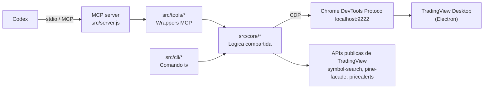

# Arquitectura de TradingView MCP para Codex

## Resumen

Este proyecto conecta Codex con TradingView Desktop mediante MCP y CDP. La
idea central es simple:

1. Codex habla con el servidor MCP por `stdio`.
2. El servidor MCP delega en la capa `core`.
3. La capa `core` lee y controla TradingView Desktop por CDP en
   `localhost:9222`.
4. Algunas herramientas usan tambien APIs publicas de TradingView para tareas
   concretas como busqueda de simbolos o compilacion de Pine Script.

El sistema esta pensado para operar sobre la instancia local de TradingView,
no sobre una integracion directa con los servidores de TradingView.

## Diagrama

## Componentes

### Codex

Es el cliente que carga el servidor MCP. Codex lee `AGENTS.md` y usa las
herramientas expuestas por el servidor para interactuar con TradingView.

### MCP server

`src/server.js` crea la instancia de `McpServer`, registra todos los grupos de
herramientas y publica instrucciones de alto nivel para la eleccion de
herramientas.

### Capa `core`

`src/core/` contiene la logica real:

- `chart` para simbolos, timeframe, tipo y rangos visibles.
- `data` para OHLCV, indicadores, lines, labels, tables, boxes y estrategia.
- `pine` para editar, compilar, analizar y abrir scripts.
- `replay` para modo replay y trading simulado.
- `drawing`, `alerts`, `watchlist`, `pane`, `tab`, `ui`, `capture`, `stream`.

### Capa `tools`

`src/tools/` adapta las funciones de `core` al formato MCP. Cada archivo de
herramientas define los nombres que ve Codex, los esquemas de entrada y la
respuesta serializada.

### CLI

`src/cli/` reutiliza la misma logica de `core` para ofrecer el comando `tv`.
Eso permite probar y usar el servidor sin pasar por un cliente MCP.

### TradingView Desktop

Es la fuente de verdad para el estado del chart. El servidor consulta el DOM,
el modelo interno y los objetos React/Electron expuestos por TradingView
Desktop.

## Flujos principales

### Lectura de chart

Codex -> MCP -> `core/chart` o `core/data` -> CDP -> TradingView Desktop ->
respuesta JSON.

### Cambio de estado

Codex -> MCP -> `core/chart`, `core/drawing`, `core/alerts`, `core/pane`,
etc. -> CDP -> TradingView Desktop -> respuesta JSON.

### Pine Script

Codex -> MCP -> `core/pine` -> editor Monaco / APIs de TradingView ->
resultado de compilacion o error.

### Replay y streaming

Codex -> MCP -> `core/replay` o `core/stream` -> CDP -> TradingView Desktop ->
eventos JSONL o estado puntual.

## Notas practicas

- La mayoria de las operaciones son locales y efimeras.
- Los datos se mantienen compactos por defecto para proteger el contexto del
  agente.
- La compatibilidad depende de APIs internas de TradingView que pueden cambiar
  entre versiones.
- La documentacion y el runtime deben dejar claro que este proyecto no es un
  bot de trading automatizado.

