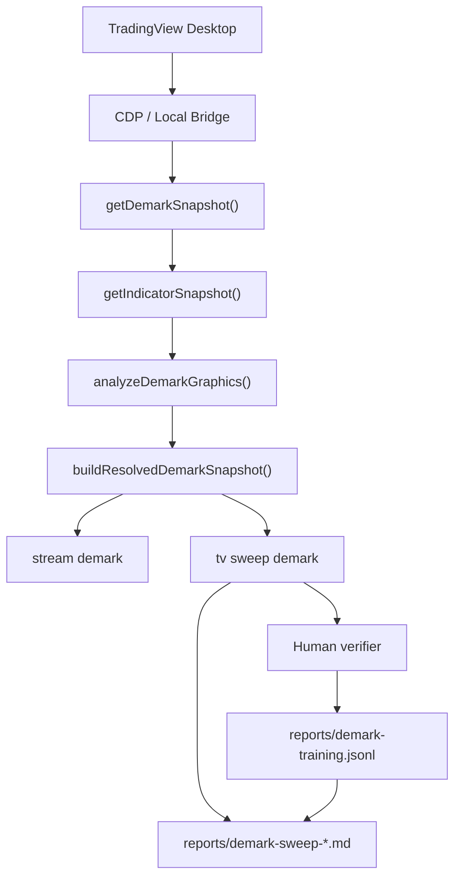

# DeMARK Architecture

## Shared path

- `stream demark` and `mcp getDemarkSnapshot()` share the same resolution path.
- The stream only formats the snapshot for terminal display.
- The sweep now records human verdicts as training examples in JSONL.

## Goals

- Keep one shared snapshot path.
- Keep count-type and direction logic deterministic.
- Preserve known-good behavior on higher timeframes.
- Use human corrections as regression training data for future heuristics.

## Sweep Findings

### Working

- `12M`
- `M`
- `W`
- `D`
- `1h`

### Needs Review

- `8h`
- `4h`
- `2h`
- `30m`
- `5m`
- `1m`

### Common Failure Pattern

- Dense lower timeframes are more likely to misclassify direction or collapse overlapping labels.
- The readiness gate was too weak and timed out while the study was still settling.
- Human corrections should be preserved as ground truth for later regression cases.
